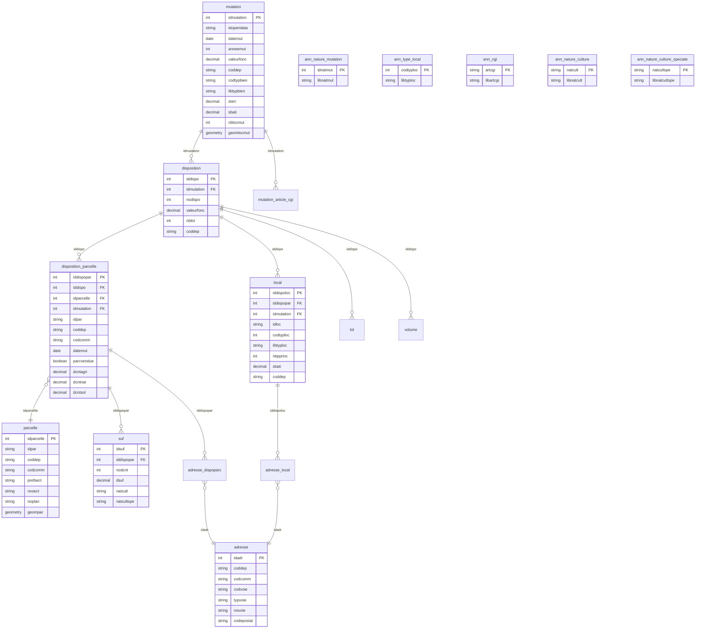

# DATA SOURCES — Valeurs Foncières Analytics

> Single source of truth for all data in this project.
> Generated by: data-analyst agent (PRE-EXPLORE mode — from Cerema documentation, not yet verified against actual dump)
> Last updated: 2026-03-12
> Documentation reference: https://doc-datafoncier.cerema.fr/doc/dv3f/

## ⚠️ Confidence Levels

This document was generated BEFORE restoring the actual SQL dump. Each piece of information is tagged:
- ✅ **CONFIRMED** — from official Cerema documentation
- ⚠️ **ASSUMED** — inferred from documentation, needs verification after restore
- ❓ **UNKNOWN** — will be determined during EXPLORE phase

---

## 1. Source Overview

| Attribute | Value | Confidence |
|-----------|-------|------------|
| Source name | DVF+ Open Data | ✅ |
| Publisher | Cerema (DGALN) | ✅ |
| Content | All real estate transactions in France (notarized sales) | ✅ |
| Period | January 2014 — June 2025 | ✅ |
| Update frequency | 2x/year (April + October) | ✅ |
| Latest release | October 2025 | ✅ |
| Volume (rows) | ~20M+ mutations (France) | ⚠️ |
| Download format | SQL dump (PostgreSQL/PostGIS) | ✅ |
| Download URL | https://cerema.app.box.com/v/dvfplus-opendata | ✅ |
| API (alternative) | https://apidf-preprod.cerema.fr/swagger/ | ✅ |
| Raw file size | ~4-5 GB (full France SQL dump) | ⚠️ |
| License | Licence Ouverte v2.0 (free reuse) | ✅ |
| Dictionary | https://doc-datafoncier.cerema.fr/doc/dv3f/ | ✅ |
| Projection (geometry) | EPSG varies by region (2154 metro, 2975 Réunion, etc.) | ✅ |
| Encoding | UTF-8 | ✅ |

### Important: DVF+ Open Data vs DV3F

The Cerema dictionary documents **DV3F** (enriched version). DVF+ open-data is a **subset**:

| Feature | DVF+ Open Data (our source) | DV3F (restricted) |
|---------|----------------------------|--------------------|
| Access | Free, open | Convention required (SAFER, collectivités) |
| Tables | 12 main + 5 annexe = 17 | 13 main + 7 annexe = 20 |
| `ff*` columns (Fichiers fonciers) | ❌ NOT available | ✅ Available |
| `acheteur_vendeur` table | ❌ NOT available | ✅ Available |
| Buyer/seller names (`l_nomv`, `l_noma`) | ❌ NOT available | ✅ Available (anonymized) |
| `idmutinvar` (real mutation ID) | Replaced by `idopendata` | ✅ Real ID |
| Construction year (`ffancst*`) | ❌ NOT available | ✅ Available |
| Social housing (`ffnblogsoc`) | ❌ NOT available | ✅ Available |

**Rule**: When reading the Cerema dictionary, ignore all columns prefixed with `ff` and all references to `acheteur_vendeur`. These are DV3F-only.

---

## 2. Entity Relationship Diagram



---

## 3. Source Tables

### 3.1 MAIN TABLES (3 principal + 9 secondary)

---

### `mutation` — Principal Table ⭐

| Attribute | Value | Confidence |
|-----------|-------|------------|
| **Grain** | One row per real estate transaction (sale deed) | ✅ |
| **Primary key** | `idmutation` (integer, auto-generated) | ✅ |
| **Business key** | `idopendata` (string, replaces `idmutinvar` in open-data) | ✅ |
| **Estimated volume** | ~20M rows (France, 2014-2025) | ⚠️ |
| **Geometry columns** | `geomlocmut`, `geomparmut`, `geompar` (PostGIS) | ✅ |

#### Key Columns

| Column | Type | Nullable | Description | Example | Confidence |
|--------|------|----------|-------------|---------|------------|
| `idmutation` | integer | NO | Primary key | 1234567 | ✅ |
| `idopendata` | varchar | NO | Open-data mutation identifier | "2020-12345" | ✅ |
| `idnatmut` | integer | NO | FK → ann_nature_mutation (sale type) | 1 | ✅ |
| `datemut` | date | NO | Transaction date (deed signature) | 2023-06-15 | ✅ |
| `anneemut` | integer | NO | Transaction year | 2023 | ✅ |
| `moismut` | integer | NO | Transaction month | 6 | ✅ |
| `coddep` | varchar | NO | Department code | "75" | ✅ |
| `libnatmut` | varchar | NO | Mutation type label | "Vente" | ✅ |
| `vefa` | boolean | YES | True if VEFA (off-plan sale) | false | ✅ |
| `valeurfonc` | decimal | YES | Transaction price (EUR) | 250000.00 | ✅ |
| `nbdispo` | integer | YES | Number of dispositions | 1 | ✅ |
| `nblot` | integer | YES | Total number of lots | 0 | ✅ |
| `nbcomm` | integer | YES | Number of communes involved | 1 | ✅ |
| `l_codinsee` | varchar[] | YES | List of INSEE commune codes | {"97411"} | ✅ |
| `nbpar` | integer | YES | Number of parcels involved | 1 | ✅ |
| `nbparmut` | integer | YES | Number of parcels that changed hands | 1 | ✅ |
| `sterr` | decimal | YES | Total land area sold (m²) | 850.00 | ✅ |
| `nblocmut` | integer | YES | Number of premises sold | 1 | ✅ |
| `nblocmai` | integer | YES | Number of houses sold | 1 | ✅ |
| `nblocapt` | integer | YES | Number of apartments sold | 0 | ✅ |
| `nblocdep` | integer | YES | Number of outbuildings sold | 0 | ✅ |
| `nblocact` | integer | YES | Number of commercial premises sold | 0 | ✅ |
| `sbati` | decimal | YES | Total built area sold (m²) | 120.00 | ✅ |
| `sbatmai` | decimal | YES | Total house area sold (m²) | 120.00 | ✅ |
| `sbatapt` | decimal | YES | Total apartment area sold (m²) | 0.00 | ✅ |
| `codtypbien` | varchar | YES | GnDVF property type code | "111" | ✅ |
| `libtypbien` | text | YES | GnDVF property type label | "UN APPARTEMENT" | ✅ |
| `l_dcnt` | decimal[] | YES | Ordered list of land use surfaces (01-13) | {0,0,850,...} | ✅ |
| `nbsuf` | integer | YES | Number of land subdivisions sold | 1 | ✅ |
| `geomlocmut` | geometry | YES | Point geometry of sold premises | PostGIS point | ✅ |
| `geomparmut` | geometry | YES | Polygon geometry of sold parcels | PostGIS polygon | ✅ |
| `geompar` | geometry | YES | Polygon geometry of all parcels involved | PostGIS polygon | ✅ |

#### Data Quality Notes
- `valeurfonc = 0` or NULL: non-market transactions (gifts, inheritance) — **must filter** | ✅
- `geomlocmut` may be NULL for rural areas with poor geocoding | ⚠️
- `codtypbien` encoding: hierarchical code (level 1: 1=built, 2=unbuilt; level 2+: detail) | ✅
- Array columns (`l_codinsee`, `l_dcnt`, etc.) are PostgreSQL arrays — must be handled for BigQuery export | ✅
- Last semesters may lack exhaustivity due to registration delays | ✅

---

### `disposition` — Secondary Table

| Attribute | Value | Confidence |
|-----------|-------|------------|
| **Grain** | One row per disposition (sub-transaction within a mutation) | ✅ |
| **Primary key** | `iddispo` | ✅ |
| **Foreign key** | `idmutation` → `mutation` | ✅ |
| **Estimated volume** | ~25M rows | ⚠️ |

#### Key Columns

| Column | Type | Nullable | Description | Confidence |
|--------|------|----------|-------------|------------|
| `iddispo` | integer | NO | Primary key | ✅ |
| `idmutation` | integer | NO | FK → mutation | ✅ |
| `nodispo` | integer | NO | Disposition number within mutation | ✅ |
| `valeurfonc` | decimal | YES | Price for this disposition | ✅ |
| `nblot` | integer | YES | Number of lots in this disposition | ✅ |
| `coddep` | varchar | NO | Department code | ✅ |

---

### `disposition_parcelle` — Principal Table ⭐

| Attribute | Value | Confidence |
|-----------|-------|------------|
| **Grain** | One row per parcel involved in a disposition | ✅ |
| **Primary key** | `iddispopar` | ✅ |
| **Foreign keys** | `iddispo` → `disposition`, `idparcelle` → `parcelle`, `idmutation` → `mutation` | ✅ |
| **Estimated volume** | ~25M rows | ⚠️ |

#### Key Columns

| Column | Type | Nullable | Description | Confidence |
|--------|------|----------|-------------|------------|
| `iddispopar` | integer | NO | Primary key | ✅ |
| `iddispo` | integer | NO | FK → disposition | ✅ |
| `idparcelle` | integer | NO | FK → parcelle | ✅ |
| `idmutation` | integer | NO | FK → mutation | ✅ |
| `idpar` | varchar | YES | Parcel identifier (same as Fichiers fonciers) | ✅ |
| `coddep` | varchar | NO | Department code | ✅ |
| `codcomm` | varchar | NO | INSEE commune code | ✅ |
| `prefsect` | varchar | YES | Parcel section prefix | ✅ |
| `nosect` | varchar | YES | Parcel section number | ✅ |
| `noplan` | varchar | YES | Parcel number | ✅ |
| `datemut` | date | NO | Transaction date | ✅ |
| `anneemut` | integer | NO | Transaction year | ✅ |
| `parcvendue` | boolean | YES | True if parcel is part of the sale | ✅ |
| `dcnt01`...`dcnt13` | decimal | YES | Land use surface by type (01 to 13) | ✅ |
| `dcntsol` | decimal | YES | Built land surface | ✅ |
| `dcntagri` | decimal | YES | Agricultural land surface | ✅ |
| `dcntnat` | decimal | YES | Natural land surface | ✅ |

---

### `local` — Principal Table ⭐

| Attribute | Value | Confidence |
|-----------|-------|------------|
| **Grain** | One row per premises (building) involved in a disposition | ✅ |
| **Primary key** | `iddispoloc` | ✅ |
| **Foreign keys** | `iddispopar` → `disposition_parcelle`, `idmutation` → `mutation` | ✅ |
| **Estimated volume** | ~15M rows | ⚠️ |

#### Key Columns

| Column | Type | Nullable | Description | Confidence |
|--------|------|----------|-------------|------------|
| `iddispoloc` | integer | NO | Primary key | ✅ |
| `iddispopar` | integer | NO | FK → disposition_parcelle | ✅ |
| `idmutation` | integer | NO | FK → mutation | ✅ |
| `idloc` | varchar | YES | Premises identifier | ✅ |
| `codtyploc` | integer | YES | Premises type code (1=house, 2=apt, 3=outbuilding, 4=commercial) | ✅ |
| `libtyploc` | varchar | YES | Premises type label | ✅ |
| `nbpprinc` | integer | YES | Number of main rooms | ✅ |
| `sbati` | decimal | YES | Built surface (m²) | ✅ |
| `coddep` | varchar | NO | Department code | ✅ |
| `datemut` | date | NO | Transaction date | ✅ |
| `anneemut` | integer | NO | Transaction year | ✅ |

#### `codtyploc` Values
| Code | Label (FR) | Label (EN) |
|------|-----------|------------|
| 1 | Maison | House |
| 2 | Appartement | Apartment |
| 3 | Dépendance | Outbuilding/dependency |
| 4 | Local industriel, commercial ou assimilé | Commercial/industrial premises |

---

### `parcelle` — Secondary Table

| Attribute | Value | Confidence |
|-----------|-------|------------|
| **Grain** | One row per cadastral parcel | ✅ |
| **Primary key** | `idparcelle` | ✅ |
| **Estimated volume** | ~20M rows | ⚠️ |
| **Geometry** | `geompar` (PostGIS polygon — parcel boundary) | ✅ |

#### Key Columns

| Column | Type | Nullable | Description | Confidence |
|--------|------|----------|-------------|------------|
| `idparcelle` | integer | NO | Primary key | ✅ |
| `idpar` | varchar | YES | Parcel identifier (dept+commune+prefix+section+number) | ✅ |
| `coddep` | varchar | NO | Department code | ✅ |
| `codcomm` | varchar | NO | INSEE commune code | ✅ |
| `prefsect` | varchar | YES | Section prefix | ✅ |
| `nosect` | varchar | YES | Section number | ✅ |
| `noplan` | varchar | YES | Parcel number | ✅ |
| `geompar` | geometry | YES | Parcel boundary polygon (PostGIS) | ✅ |

---

### `adresse` — Secondary Table

| Attribute | Value | Confidence |
|-----------|-------|------------|
| **Grain** | One row per unique address | ✅ |
| **Primary key** | `idadr` | ✅ |
| **Estimated volume** | ~20M rows | ⚠️ |

#### Key Columns

| Column | Type | Nullable | Description | Confidence |
|--------|------|----------|-------------|------------|
| `idadr` | integer | NO | Primary key | ✅ |
| `coddep` | varchar | NO | Department code | ✅ |
| `codcomm` | varchar | NO | INSEE commune code | ✅ |
| `codvoie` | varchar | YES | Street code | ✅ |
| `typvoie` | varchar | YES | Street type (RUE, AVE, etc.) | ✅ |
| `novoie` | varchar | YES | Street number | ✅ |
| `codepostal` | varchar | YES | Postal code | ✅ |

---

### `suf` — Secondary Table (Subdivisions Fiscales)

| Attribute | Value | Confidence |
|-----------|-------|------------|
| **Grain** | One row per fiscal land subdivision | ✅ |
| **Primary key** | `idsuf` | ✅ |
| **Foreign key** | `iddispopar` → `disposition_parcelle` | ✅ |
| **Estimated volume** | ~30M rows | ⚠️ |

#### Key Columns

| Column | Type | Nullable | Description | Confidence |
|--------|------|----------|-------------|------------|
| `idsuf` | integer | NO | Primary key | ✅ |
| `iddispopar` | integer | NO | FK → disposition_parcelle | ✅ |
| `nodcnt` | integer | YES | Land use type code (01 to 13) | ✅ |
| `dsuf` | decimal | YES | Surface of the subdivision (m²) | ✅ |
| `natcult` | varchar | YES | Nature of cultivation code | ✅ |
| `natcultspe` | varchar | YES | Special cultivation code | ✅ |

---

### Other Secondary Tables

| Table | Grain | PK | FK | Est. Rows | Confidence |
|-------|-------|----|----|-----------|------------|
| `lot` | One row per lot in a disposition | `idlot` | `iddispo` → disposition | ❓ | ✅ |
| `volume` | One row per volume (vertical co-ownership) | `idvol` | `iddispo` → disposition | ❓ | ✅ |
| `mutation_article_cgi` | Link mutation ↔ tax article | `idmutart` | `idmutation` → mutation | ❓ | ✅ |
| `adresse_dispoparc` | Link address ↔ disposition_parcelle | composite | `iddispopar`, `idadr` | ❓ | ✅ |
| `adresse_local` | Link address ↔ local | composite | `iddispoloc`, `idadr` | ❓ | ✅ |

---

### 3.2 ANNEXE TABLES (reference data)

| Table | PK | Content | Example Values | Confidence |
|-------|----|---------|---------------|------------|
| `ann_nature_mutation` | `idnatmut` | Mutation type labels | 1="Vente", 2="Vente en l'état futur d'achèvement", 3="Echange", 4="Vente de terrain à bâtir", 5="Adjudication" | ✅ |
| `ann_type_local` | `codtyploc` | Premises type labels | 1="Maison", 2="Appartement", 3="Dépendance", 4="Local industriel..." | ✅ |
| `ann_cgi` | `artcgi` | Tax code article references | "257-7-1-2", "683", etc. | ✅ |
| `ann_nature_culture` | `natcult` | Land use type labels | "T"="Terre", "P"="Pré", "VE"="Verger", "VI"="Vigne", "BT"="Bois taillis" | ✅ |
| `ann_nature_culture_speciale` | `natcultspe` | Special cultivation labels | Specific crop types | ✅ |

**Note**: DVF+ open-data does NOT have `ann_typologie` and `ann_typpro` (DV3F only).

---

## 4. Join Keys Reference

| Parent Table | Child Table | Join Key | Relationship | Confidence |
|-------------|-------------|----------|-------------|------------|
| `mutation` | `disposition` | `idmutation` | 1:N (one mutation, multiple dispositions) | ✅ |
| `mutation` | `mutation_article_cgi` | `idmutation` | 1:N | ✅ |
| `disposition` | `disposition_parcelle` | `iddispo` | 1:N (one disposition, multiple parcels) | ✅ |
| `disposition` | `local` | `iddispo` | 1:N (one disposition, multiple premises) | ✅ |
| `disposition` | `lot` | `iddispo` | 1:N | ✅ |
| `disposition` | `volume` | `iddispo` | 1:N | ✅ |
| `disposition_parcelle` | `parcelle` | `idparcelle` | N:1 (many disp_parcelle, one parcelle) | ✅ |
| `disposition_parcelle` | `suf` | `iddispopar` | 1:N | ✅ |
| `disposition_parcelle` | `adresse_dispoparc` | `iddispopar` | 1:N | ✅ |
| `local` | `adresse_local` | `iddispoloc` | 1:N | ✅ |
| `adresse_dispoparc` | `adresse` | `idadr` | N:1 | ✅ |
| `adresse_local` | `adresse` | `idadr` | N:1 | ✅ |
| `mutation` | `ann_nature_mutation` | `idnatmut` | N:1 | ✅ |
| `local` | `ann_type_local` | `codtyploc` | N:1 | ✅ |

---

## 5. Transformation Lineage (Target)

```
SOURCE (PostgreSQL restore)          STAGING (BigQuery views)           INTERMEDIATE              MARTS (BigQuery tables)
─────────────────────────           ─────────────────────────          ──────────────           ─────────────────────────
mutation ──────────────────→ stg_dvf__mutations ─────────┐
disposition ───────────────→ stg_dvf__dispositions ──────┤
local ─────────────────────→ stg_dvf__locals ────────────┼──→ int_transactions__enriched ──→ fct_transactions
disposition_parcelle ──────→ stg_dvf__parcelles ─────────┘                                    dim_communes
parcelle ──────────────────→ (joined in intermediate)                                         dim_property_types
adresse ───────────────────→ (joined in intermediate)                                         dim_dates

ann_nature_mutation ───────→ dbt seed (reference)
ann_type_local ────────────→ dbt seed (reference)
ann_nature_culture ────────→ dbt seed (reference)
```

---

## 6. Target Mart Tables (Kimball Star Schema)

### `fct_transactions` — Fact Table

| Column | Type | Source | Business Rule |
|--------|------|--------|---------------|
| `transaction_id` | STRING | mutation.idopendata | Business key |
| `transaction_date` | DATE | mutation.datemut | Direct mapping |
| `transaction_year` | INTEGER | mutation.anneemut | Partition key |
| `department_code` | STRING | mutation.coddep | Cluster key 1 |
| `commune_code` | STRING | disposition_parcelle.codcomm | From join |
| `property_type_code` | STRING | mutation.codtypbien | Cluster key 2 |
| `property_type_label` | STRING | mutation.libtypbien | Direct mapping |
| `transaction_price_eur` | NUMERIC | mutation.valeurfonc | Filter: > 0 |
| `land_area_sqm` | NUMERIC | mutation.sterr | Nullable |
| `built_area_sqm` | NUMERIC | mutation.sbati | Nullable |
| `price_per_sqm` | NUMERIC | COMPUTED | valeurfonc / NULLIF(sbati, 0) |
| `nb_premises` | INTEGER | mutation.nblocmut | Direct mapping |
| `nb_houses` | INTEGER | mutation.nblocmai | Direct mapping |
| `nb_apartments` | INTEGER | mutation.nblocapt | Direct mapping |
| `nb_rooms` | INTEGER | local.nbpprinc | From join (max or sum) |
| `is_vefa` | BOOLEAN | mutation.vefa | Direct mapping |
| `mutation_nature` | STRING | ann_nature_mutation.libnatmut | From join |
| `latitude` | FLOAT | ST_Y(mutation.geomlocmut) | Extracted from PostGIS |
| `longitude` | FLOAT | ST_X(mutation.geomlocmut) | Extracted from PostGIS |

**Grain**: One row per transaction (mutation)
**Partitioning**: `transaction_year` (integer range)
**Clustering**: `department_code`, `property_type_code`

### `dim_communes`

| Column | Type | Source | Business Rule |
|--------|------|--------|---------------|
| `commune_code` | STRING | disposition_parcelle.codcomm | PK, INSEE code |
| `department_code` | STRING | disposition_parcelle.coddep | First 2-3 chars |
| `commune_name` | STRING | ❓ UNKNOWN | Not in DVF+ — needs external source or seed |
| `postal_code` | STRING | adresse.codepostal | From join |

### `dim_property_types`

| Column | Type | Source | Business Rule |
|--------|------|--------|---------------|
| `property_type_code` | STRING | mutation.codtypbien | PK |
| `property_type_label` | STRING | mutation.libtypbien | Direct mapping |
| `property_type_level1` | STRING | COMPUTED | First char of codtypbien (1=built, 2=unbuilt) |
| `property_type_level1_label` | STRING | COMPUTED | "Built property" / "Unbuilt land" |

### `dim_dates`

| Column | Type | Source | Business Rule |
|--------|------|--------|---------------|
| `date_key` | DATE | generated | PK, every date from 2014-01-01 to 2025-12-31 |
| `year` | INTEGER | COMPUTED | EXTRACT(YEAR) |
| `quarter` | INTEGER | COMPUTED | EXTRACT(QUARTER) |
| `month` | INTEGER | COMPUTED | EXTRACT(MONTH) |
| `month_name` | STRING | COMPUTED | FORMAT_DATE("%B") |
| `day_of_week` | INTEGER | COMPUTED | EXTRACT(DAYOFWEEK) |
| `is_weekend` | BOOLEAN | COMPUTED | DAYOFWEEK IN (1, 7) |

---

## 7. Data Quality Rules

| Rule | Table | Column(s) | Type | Threshold | Confidence |
|------|-------|-----------|------|-----------|------------|
| PK uniqueness | mutation | idmutation | unique | 0 duplicates | ✅ |
| PK uniqueness | disposition | iddispo | unique | 0 duplicates | ✅ |
| PK uniqueness | local | iddispoloc | unique | 0 duplicates | ✅ |
| Not null | mutation | idmutation, datemut, coddep | not_null | 0% null | ✅ |
| Price filter | mutation | valeurfonc | range | > 0 for analysis | ✅ |
| Date range | mutation | datemut | range | 2014-01-01 to 2025-06-30 | ✅ |
| Year coherence | mutation | anneemut | range | 2014 to 2025 | ✅ |
| FK integrity | disposition | idmutation | relationship | 0 orphans | ⚠️ |
| FK integrity | disposition_parcelle | iddispo | relationship | 0 orphans | ⚠️ |
| FK integrity | local | iddispopar | relationship | 0 orphans | ⚠️ |
| Department code | mutation | coddep | accepted_values | Valid FR dept codes | ⚠️ |
| Property type | mutation | codtypbien | not_null | For analysis subset | ⚠️ |
| Geometry validity | mutation | geomlocmut | custom | Check null rate | ❓ |

---

## 8. BigQuery-Specific Considerations

### PostGIS → BigQuery Migration

| PostGIS Column | BigQuery Handling | Confidence |
|---------------|-------------------|------------|
| `geomlocmut` (point) | Extract as `latitude` (FLOAT) + `longitude` (FLOAT) via `ST_Y()`, `ST_X()` | ✅ |
| `geomparmut` (polygon) | Drop for this project (parcel boundaries not needed for dashboard) | ⚠️ |
| `geompar` (polygon) | Drop for this project | ⚠️ |

### PostgreSQL Array Columns → BigQuery

| PG Column | Type | BigQuery Handling | Confidence |
|-----------|------|-------------------|------------|
| `l_codinsee` | varchar[] | Unnest to first element or REPEATED STRING | ⚠️ |
| `l_dcnt` | decimal[] | Drop (detailed surfaces available via suf table) | ⚠️ |
| `l_idpar` | varchar[] | Drop (available via disposition_parcelle join) | ⚠️ |
| `l_artcgi` | varchar[] | Drop (available via mutation_article_cgi join) | ⚠️ |

---

## 9. Glossary

| Term (FR) | Term (EN) | Definition |
|-----------|-----------|------------|
| Mutation | Transaction | A real estate sale recorded by a notary |
| Disposition | Disposition | A sub-part of a transaction (tax concept) |
| Valeur foncière | Property value | The declared price of the transaction |
| Parcelle | Parcel | A cadastral land unit |
| Local | Premises | A building unit (house, apartment, commercial) |
| SUF (Subdivision Fiscale) | Fiscal Subdivision | A portion of a parcel with specific land use |
| Code INSEE | INSEE Code | Unique 5-digit commune identifier |
| VEFA | Off-plan sale | "Vente en l'État Futur d'Achèvement" — buying before construction is complete |
| DIA | Declaration of Intent to Sell | Notary notification to SAFER for agricultural land |
| Codtypbien | Property type code | Hierarchical code from GnDVF (1xx=built, 2xx=unbuilt) |
| Nature de culture | Land use type | Agricultural classification (T=earth, P=meadow, VE=orchard, VI=vineyard) |
| CGI | General Tax Code | "Code Général des Impôts" — tax articles linked to the transaction |
| DVF+ | Structured DVF | Cerema's relational restructuring of raw DVF data |
| DV3F | Enriched DVF | DVF+ crossed with Fichiers fonciers (restricted access) |
| GnDVF | National DVF Group | Working group that defined the DVF+ data model |

---

## 10. Verification Checklist (for EXPLORE phase)

After restoring the SQL dump, the data-analyst agent must verify:

- [ ] Actual number of tables in the dump (expected: 17, confirm not 20/DV3F)
- [ ] Actual row counts per table vs estimates above
- [ ] Confirm `ff*` columns are NOT present (DVF+ open-data, not DV3F)
- [ ] Confirm `acheteur_vendeur` table does NOT exist
- [ ] Confirm `idopendata` exists (not `idmutinvar`)
- [ ] Null rate on `valeurfonc` (percentage of non-market transactions)
- [ ] Null rate on `geomlocmut` (geocoding coverage)
- [ ] Null rate on `codtypbien` (property type coverage)
- [ ] Join integrity: disposition → mutation (orphan count)
- [ ] Join integrity: local → disposition_parcelle (orphan count)
- [ ] Department codes: list all unique `coddep` values
- [ ] Date range: MIN/MAX of `datemut`
- [ ] PostgreSQL array column handling: test export of `l_codinsee`
- [ ] PostGIS geometry: test `ST_X()`, `ST_Y()` extraction
- [ ] Encoding: confirm UTF-8 throughout
- [ ] Total dump size on disk after restore

---

*Generated by data-analyst agent (PRE-EXPLORE mode) — 2026-03-12*
*Source: Cerema DV3F dictionary (https://doc-datafoncier.cerema.fr/doc/dv3f/)*
*⚠️ This document must be updated after actual data exploration (EXPLORE mode)*
